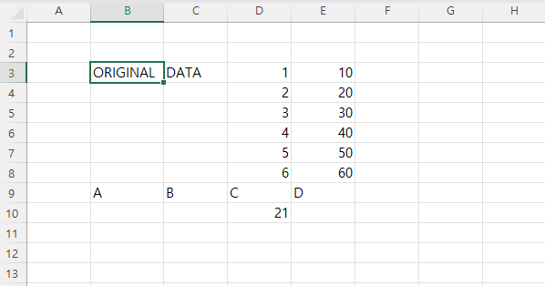
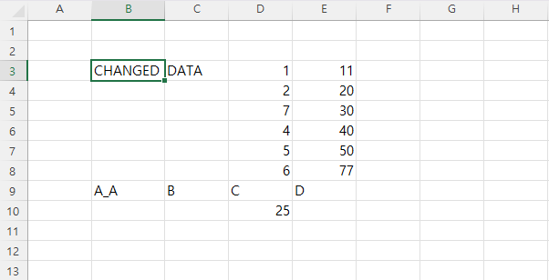
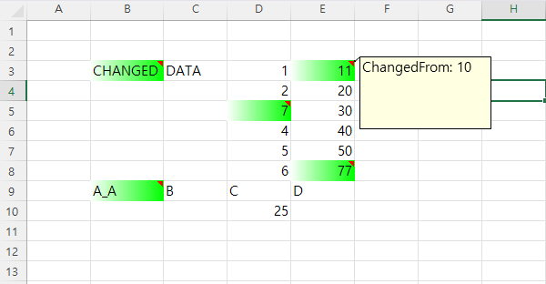

# Excel Diff Checker
아주 유사한 엑셀파일 두개의 차이를 구분해서, 새로운 파일에 표시를 하는 프로그램이다.

기존 형식을 유지한 채, 새로운 버전으로 갱신된 파일의 변경사항을 좀 더 쉽게 알기 위해 개발했다.

일을 하다보니, 프로젝트 계획단계 때 엔지니어가 계획한 TAG 이름(String)이 현장 상황에 따라 달라지는 경우 가 꽤나있었다. 이럴때 마다 Excel 파일을 달라진 TAG 로 갱신해서 보내주시는데, 워낙 많은 양이 적힌 Excel 이다 보니까 어떤 값이 바뀌었는지 하나 하나 대조하기가 너무 귀찮고 눈이 빠질 것 만 같았다.

때문에 형식이 같은 두개의 엑셀 파일을 대조하여, 바뀐 Cell 만 표시하도록 하는 프로그램을 간단히 만들었다.

Sheet 가 여러개여도 문제가 없지만, 원본 파일과 새 파일의 Sheet 이름이 일치하여야 대조할수있다.

### 사용예시

###### 원본 파일

###### 바뀐 파일

###### 실행 결과 생성된 파일

바뀐 cell 의 바탕색을 칠하고, 이전 값을 `메모` 로 작성하여 알려준다.

D10 셀의 경우 SUM 함수를 사용했기 때문에 값이 변했음에도 따로 표시를 하지 않는다.

